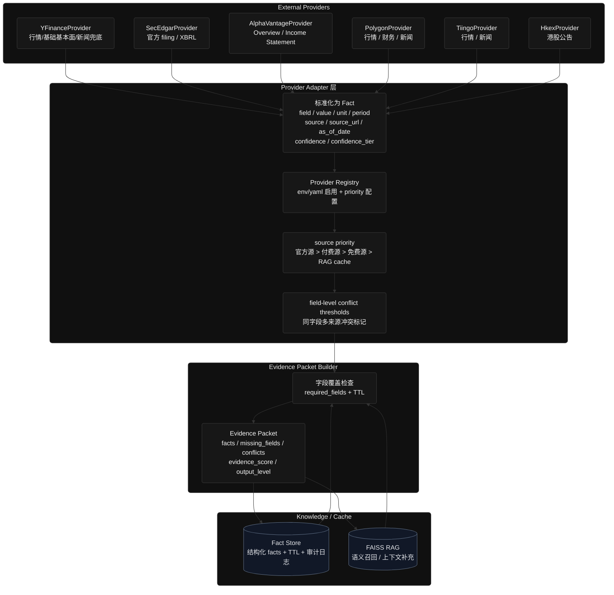
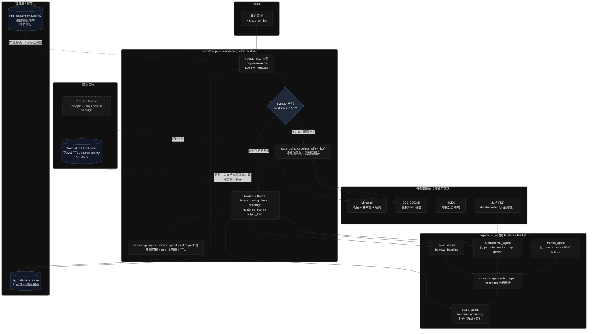

# AlphaPilot 数据源与 RAG 现状总结

> 记录日期：2026-06-05  
> 涵盖问题：  
> 1. `fundamental_agent` 的 RAG 知识库现状（是否只有 Tesla？静态还是动态？）  
> 2. `market_agent` 的市场数据是否只依赖 yfinance？

---

## 目录

- [问题一：fundamental_agent 与 RAG 知识库](#问题一fundamental_agent-与-rag-知识库)
  - [结论摘要](#结论摘要)
  - [fundamental_agent 本身不直接调 RAG](#fundamental_agent-本身不直接调-rag)
  - [项目存在两套 RAG 后端](#项目存在两套-rag-后端)
  - [当前知识库实际内容](#当前知识库实际内容)
  - [主流程中 RAG 如何参与基本面分析](#主流程中-rag-如何参与基本面分析)
  - [静态 vs 动态：设计意图与实际行为](#静态-vs-动态设计意图与实际行为)
  - [本地 PDF 财报（非向量 RAG）](#本地-pdf-财报非向量-rag)
- [问题二：market_agent 与 yfinance](#问题二market_agent-与-yfinance)
  - [结论摘要](#结论摘要-1)
  - [数据获取的两条路径](#数据获取的两条路径)
  - [yfinance 是唯一外部行情源](#yfinance-是唯一外部行情源)
  - [本地计算 vs 外部 API](#本地计算-vs-外部-api)
  - [RAG 与 market_agent 的关系](#rag-与-market_agent-的关系)
  - [容错机制（仍在 yfinance 链路上）](#容错机制仍在-yfinance-链路上)
  - [失败时的表现](#失败时的表现)
- [多数据源扩展方案：Polygon / Tiingo / Alpha Vantage / SEC](#多数据源扩展方案polygon--tiingo--alpha-vantage--sec)
- [架构关系总览](#架构关系总览)
- [已知局限与后续改进方向](#已知局限与后续改进方向)

---

## 问题一：fundamental_agent 与 RAG 知识库

### 结论摘要

| 维度 | 现状 |
|------|------|
| 知识库标的覆盖 | **实质只有 Tesla（TSLA）** 相关文档 |
| 知识库形态 | **静态知识库**（脚本/手工写入后持久化到本地磁盘） |
| 动态入库能力 | 代码已实现（`upsert_packet`），但 **主流程未接入** |
| fundamental_agent 与 RAG | Agent **不直接调用**向量检索；走 Evidence Packet + 可选 PDF 解析 |

---

### fundamental_agent 本身不直接调 RAG

`fundamental_agent` 只注册了一个工具：`analyze_fundamental_request_tool`，职责是 **解析财报 PDF**，不是做语义检索。

**相关文件：** `alphapilot/agents/fundamental_agent.py`

```python
fundamental_agent = create_react_agent(
    model=model,
    tools=[analyze_fundamental_request_tool],  # 仅 PDF 解析工具
    name="fundamental_expert",
    prompt="""
    - Read the "Evidence Packet" section ...
    - Use the `analyze_fundamental_request_tool` ONLY if detailed PDF-based financial report extraction is needed.
    """
)
```

`fundamental_tools.py` 中虽然定义了 `retrieve_financial_context()`（调用 Chroma 向量库），但：

- **未注册为 agent 工具**
- **主 workflow 不会调用**
- 属于闲置辅助函数

---

### 项目存在两套 RAG 后端

这是理解现状的关键——两套系统并存，主流程只用其中一套。

| 组件 | 实现文件 | 存储位置 | 主流程是否使用 |
|------|----------|----------|----------------|
| **FAISS** | `alphapilot/rag/retriever.py` | `alphapilot/rag_data/faiss_index/` | **是** — `workflow.py` 的 `evidence_packet_builder` |
| **ChromaDB** | `alphapilot/rag/vectorstore.py` | `alphapilot/rag_data/chroma.sqlite3` | **否（主流程）** — 测试脚本、`news_tools` 辅助函数 |

```
用户请求
    │
    ▼
evidence_packet_builder (workflow.py)
    │
    ├── FAISS retriever.retrieve_with_scores()  ← 主流程 RAG
    │
    └── 冷启动 → collect_all() → yfinance / SEC / HKEX 等 API

fundamental_agent
    │
    ├── 读 Evidence Packet（可能含 rag_context）
    └── 可选：analyze_fundamental_request_tool → 本地 PDF 解析

Chroma (vectorstore.py)  ← 旁路，测试/遗留，未接入主流程
```

---

### 当前知识库实际内容

#### ChromaDB（`financial_reports` 集合）

截至 2026-06-05，共 **4 条文档**，全部为 TSLA 相关：

| # | 来源 | 类型 | 内容摘要 |
|---|------|------|----------|
| 1 | `test_rag.py` 手工写入 | 测试数据 | TSLA 2023 营收 +19%、EPS +25%、毛利率 18.2% |
| 2 | `test_rag_documents.py` 种子 | earnings | TSLA Q4 2024 业绩：交付 495,570 辆、营收 $25.7B (+2% YoY) |
| 3 | `test_rag_documents.py` 种子 | news | 2025 年 4 月中国销量同比 +36% |
| 4 | `test_rag_documents.py` 种子 | market | RSI/MACD 技术指标（偏技术面，非基本面） |

写入方式：运行 `alphapilot/test/test_rag.py` 或 `alphapilot/test/test_rag_documents.py`。

#### FAISS 索引

- 路径：`alphapilot/rag_data/faiss_index/`
- 索引体积极小（`index.faiss` ~6KB），与 `test_rag_documents.py` 中 TSLA 种子文档一致
- **无其他股票文档**

#### 本地 PDF 财报（非向量库）

- 路径：`alphapilot/data/reports/`
- 当前仅有：`TSLA-Q4-2024-Update.pdf`（约 11MB）
- 由 `analyze_fundamental_request_tool` 直接解析，**不经过向量检索**

---

### 主流程中 RAG 如何参与基本面分析

RAG 不直接进入 `fundamental_agent`，而是通过 **Evidence Packet** 间接提供上下文：

**文件：** `alphapilot/graph/workflow.py` → `evidence_packet_builder`

```
1. retriever.retrieve_with_scores(query, k=5)     # FAISS 检索
2. 按 symbol 过滤匹配结果
3. 判断冷启动：
   - top_score < 0.55 或无 metadata → 冷启动
   - 否则将 rag_context 写入 Evidence Packet
4. 冷启动时调用 collect_all(symbol) 拉实时 API 数据
5. fundamental_agent 读取 Evidence Packet + 可选 PDF 工具
```

冷启动时基本面数字来自 `collect_fundamental_facts()`（yfinance `Ticker.info`），**不会自动写回向量库**。

---

### 静态 vs 动态：设计意图与实际行为

| 模式 | 机制 | 当前状态 |
|------|------|----------|
| **静态（实际在用）** | `rag.add_document()` / 测试脚本写入 → 持久化到 `rag_data/` | ✅ 当前行为 |
| **动态（已实现未接入）** | `knowledge/ingest_service.py` → `upsert_packet()` 将 Evidence Packet 事实写入 Chroma | ❌ 全仓库无调用方 |
| **实时 API（非 RAG）** | 冷启动 `data_collector.collect_all()` 拉 yfinance 等 | ✅ 分析非 TSLA 标的时主要靠此路径 |

`upsert_packet` 的设计逻辑（`alphapilot/knowledge/ingest_service.py`）：

- `evidence_score >= 50` 才入库
- 过滤 `LLM_INFERRED` 和低置信度 `LLM_EXTRACTED` 事实
- 每条事实写成 `{field}: {value} (source: ..., date: ...)` 存入 Chroma
- 带 TTL 元数据（`fundamental_data` 默认 180 天）

**但 workflow 结束时从未调用此函数**，因此知识库不会随分析自动增长。

---

### 本地 PDF 财报（非向量 RAG）

`analyze_fundamental_request` 的 PDF 解析链路：

```
用户 query 中的 PDF URL/路径
    ↓（若无）
data/reports/{SYMBOL}*.pdf  glob 匹配
    ↓
PyMuPDF 逐页提取 + fitz.Table 表格优先
    ↓
LLM 结构化输出 FundamentalData (Pydantic)
```

解析策略（`fundamental_tools.py`）：

- 优先从 query 提取 PDF URL 或本地路径
- 回退到 `data/reports/` 按 symbol 匹配
- 表格优先于叙事文本；含 ±80% 营收边界校验

---

## 问题二：market_agent 与 yfinance

### 结论摘要

| 维度 | 现状 |
|------|------|
| 外部行情数据源 | **仅 yfinance**（`yf.download()`） |
| 技术指标来源 | yfinance 原始 OHLCV + **本地 pandas 计算**（RSI、MACD、波动率、年化波动率） |
| Agent 设计 | **工具化已清零**（`tools=[]`），纯推理层，100% 消费 Evidence Packet |
| 其他行情 API | 未接入（无 Polygon、Alpha Vantage、IB 等） |
| RAG 角色 | 仅可能提供 `rag_context` 文本片段，**不提供结构化行情数据** |

---

### 数据获取的唯一路径：Evidence Packet Builder

`market_agent` 当前 **不持有任何工具**，已收敛为纯推理层。

**文件：** `alphapilot/agents/market_agent.py` [L13-L15](file:///Users/yvchuan/Desktop/Projects/Alphapilot/alphapilot/agents/market_agent.py#L13-L15)

```python
_MARKET_AGENT = create_react_agent(
    model=model,
    tools=[],          # ← 已清零，不做任何外部调用
    name="market_data_expert",
```

Agent prompt 硬约束 [L22-L24](file:///Users/yvchuan/Desktop/Projects/Alphapilot/alphapilot/agents/market_agent.py#L22-L24)：

> "You have NO tools. Do NOT attempt to call any tool or function."
> "If Evidence Packet market facts are missing, output 'NOT AVAILABLE' and explain the missing fields."

因此，所有行情数据 **100% 由上游 `evidence_packet_builder` 注入**，不存在 Agent 自主拉取数据的路径：

```
evidence_packet_builder (workflow.py)
  │
  ├─ RAG 命中且覆盖充足 → 从 FAISS 复用 rag_context
  │
  └─ 冷启动 / 覆盖不足
       └─ data_collector.collect_all(symbol)
            └─ collect_market_facts(symbol)   ← 唯一行情入口
                 └─ _download_price_frame(symbol)
                      └─ yf.download()        ← 唯一外部 API
                              │
                              ▼
                       本地 pandas 计算 RSI / MACD / 波动率
                              │
                              ▼
                       写入 Evidence Packet (结构化 Fact 列表)
                              │
                              ▼
                        market_agent 消费分析
```

> **注意：** `market_tools.py` 中仍存在 `fetch_market_data()` 函数，但它**未注册为 Agent 工具**，属于遗留的独立工具函数，主流程不会触发。

---

### yfinance 是唯一外部行情源

核心下载函数：`_download_price_frame()` — `alphapilot/tools/market_tools.py` [L14](file:///Users/yvchuan/Desktop/Projects/Alphapilot/alphapilot/tools/market_tools.py#L14)

```python
df = yf.download(sym, period="60d", progress=False, timeout=30)
```

在 Evidence Packet 链路中的唯一调用方：

| 函数 | 文件（行号） | 用途 |
|------|-------------|------|
| `collect_market_facts()` | `data_collector.py` [L25](file:///Users/yvchuan/Desktop/Projects/Alphapilot/alphapilot/tools/data_collector.py#L25) | 冷启动采集，产出结构化 Fact 列表写入 Evidence Packet |

`collect_market_facts` 产出的 **7 个结构化字段**，`source` 全部标注 `"yfinance"`：

| 字段 | 类型 | 置信度 | 说明 |
|------|------|--------|------|
| `current_price` | float | 0.95 | 最新收盘价 |
| `price_change_pct` | float | 0.95 | 日涨跌幅 (%) |
| `rsi_14` | float | 0.90 | 14 日相对强弱指标 |
| `macd` | float | 0.85 | MACD 线 |
| `macd_signal` | float | 0.85 | MACD 信号线 |
| `volatility_20d_annualized` | float | 0.85 | 20 日年化波动率 (%) |
| `avg_volume_20d` | int | 0.90 | 20 日均成交量 |

---

### 本地计算 vs 外部 API

yfinance 仅提供原始 OHLCV（开高低收量）；所有技术指标**均在本地用 pandas 计算**，不依赖任何外部技术分析服务：

| 指标 | 计算文件 | 公式 |
|------|----------|------|
| RSI(14) | `data_collector.py` [L68-L73](file:///Users/yvchuan/Desktop/Projects/Alphapilot/alphapilot/tools/data_collector.py#L68-L73) | `100 - 100/(1 + avg_gain_14 / avg_loss_14)` |
| MACD | `data_collector.py` [L75-L79](file:///Users/yvchuan/Desktop/Projects/Alphapilot/alphapilot/tools/data_collector.py#L75-L79) | `EMA(12) - EMA(26)`，信号线 `EMA(9)` |
| 年化波动率 | `data_collector.py` [L81-L82](file:///Users/yvchuan/Desktop/Projects/Alphapilot/alphapilot/tools/data_collector.py#L81-L82) | `std(daily_returns) × √252 × 100` |
| 日均成交量 | `data_collector.py` [L57-L61](file:///Users/yvchuan/Desktop/Projects/Alphapilot/alphapilot/tools/data_collector.py#L57-L61) | `tail(20).mean()` |

> **说明：** `market_tools.py` 中的 `fetch_market_data()` 和 `get_technical_summary()` 也有独立实现，但属遗留代码，主流程不走此路径。

---

### 容错机制：完整的下载降级链路

`_download_price_frame()` 实现了一套**多层退避策略**，始终不切换数据源，仅在 yfinance 内部降级：

**文件：** `alphapilot/tools/market_tools.py` [L14-L100](file:///Users/yvchuan/Desktop/Projects/Alphapilot/alphapilot/tools/market_tools.py#L14-L100)

```
对每个候选 symbol 格式：
  │
  ├─ 第 1 层：代理下载（60d 周期，最多 2 次重试）
  │   └─ YFRateLimitError → 指数退避 (5s × 2^attempt + jitter)
  │   └─ 其他异常 → 等待 2s 重试
  │
  ├─ 第 2 层：代理失败 → 直连重试（60d，2 次）
  │
  ├─ 第 3 层（仅港股）：1y 周期兜底下载
  │
  └─ 第 4 层：最终直连兜底（只试首选 symbol，1 次）
       └─ 仍失败 → 返回 (None, "all_attempts_failed")
```

关键容错细节：

| 机制 | 说明 | 代码位置 |
|------|------|----------|
| 代理优先 | `get_proxy_for_agent("market")` 获取代理，应对国内网络限制 | [L15](file:///Users/yvchuan/Desktop/Projects/Alphapilot/alphapilot/tools/market_tools.py#L15) |
| 限流退避 | 捕获 `YFRateLimitError`，`base_backoff=5s`，指数增长 + 随机抖动 | [L37-L39](file:///Users/yvchuan/Desktop/Projects/Alphapilot/alphapilot/tools/market_tools.py#L37-L39) |
| 港股格式自适应 | 尝试 `0700.HK` → 去前导零 `700.HK` 等多种格式 | [L20-L24](file:///Users/yvchuan/Desktop/Projects/Alphapilot/alphapilot/tools/market_tools.py#L20-L24) |
| 港股周期回退 | 60d 失败后尝试 `1y` 完整年度数据 | [L72-L78](file:///Users/yvchuan/Desktop/Projects/Alphapilot/alphapilot/tools/market_tools.py#L72-L78) |
| 最终直连兜底 | 绕过所有候选格式遍历，仅对首选 symbol 直连一次 | [L92-L100](file:///Users/yvchuan/Desktop/Projects/Alphapilot/alphapilot/tools/market_tools.py#L92-L100) |

---

### 失败时的逐级表现

| 场景 | `_download_price_frame` 返回 | `collect_market_facts` 行为 | Evidence Packet 状态 | market_agent 行为 |
|------|------------------------------|---------------------------|---------------------|-------------------|
| 下载成功 | `(df, "")` | 正常产出 7 个 Fact | 含完整结构化行情 | 正常分析 |
| yfinance 限流（重试耗尽） | `(None, error)` | 返回 error flag Fact（confidence=0.0） | `coverage.market_data = "missing"` | 检测 `output_level`，返回 "NOT AVAILABLE" |
| 数据不足（<2 行） | `df` 但 `len(close)<2` | 返回空列表 `[]` | 无市场 Fact | 同上 |
| 完全不可用（抛异常） | 异常被上层捕获 | 返回 error flag Fact | 同上 | 同上 |
| 所有 collector 失败 + 无 RAG | — | — | `allowed_output_level = insufficient_evidence` | **Escape Pod REJECT** — 直接返回 "NOT AVAILABLE"，不调 LLM |
| 所有 collector 失败 + 有 RAG | — | — | `allowed_output_level` 降级但仍含 `rag_context` | **Escape Pod DEGRADE** — 仅基于 RAG 文本片段分析 |

> **关键防护：** [market_agent.py 第 L55-L64](file:///Users/yvchuan/Desktop/Projects/Alphapilot/alphapilot/agents/market_agent.py#L55-L64) 中，当 `output_level` 为 `insufficient_evidence` 或 `data_summary_only` 时，Agent **不进入 LLM 推理**，直接返回硬编码的 "NOT AVAILABLE" 消息，从源头杜绝幻觉。

---

## 多数据源扩展方案：Polygon / Tiingo / Alpha Vantage / SEC

当前 AlphaPilot 的**有效主数据源仍是 yfinance**。SEC EDGAR 和 HKEX 虽已有辅助 collector，但尚未形成稳定主链路；FAISS RAG 是动态事实缓存，不是原始外部数据源。

下一步接入 Polygon、Tiingo、Alpha Vantage 等数据源的目标不是“多接几个 API”，而是建立一层统一的 Provider Adapter，让不同来源都输出标准化 `Fact`，再由 Evidence Packet Builder 统一评分、去重、冲突检测和降级。

### 为什么需要多数据源

当前 yfinance-only 主链路存在几个明显瓶颈：

1. **单点故障**：yfinance 限流、网络超时或字段缺失会直接导致 Evidence Packet 降级。
2. **基本面覆盖不稳定**：`pe_ratio`、`market_cap`、`revenue_growth_yoy`、`eps_growth_yoy` 经常缺失。
3. **新闻质量有限**：yfinance news 覆盖不稳定，且并非严格面向目标 ticker。
4. **港股支持有限**：港股行情可用性不稳定，基本面和公告信息需要 HKEX/其他源补强。
5. **缺少交叉验证**：单一来源无法识别字段冲突，也无法提升字段置信度。

### 候选数据源定位

| 数据源 | 适合补充 | 优点 | 局限 | 建议优先级 |
|--------|----------|------|------|------------|
| **SEC EDGAR** | 美股财报、filing、营收/EPS 原始数据 | 官方来源，可信度最高，有 source URL | 只覆盖美股；XBRL 字段映射复杂 | P0 |
| **Alpha Vantage** | Company Overview、PE、Market Cap、EPS、Revenue、Income Statement | 上手快，字段直接，适合验证基本面缺口 | 免费层约束强（如 5 calls/min、25 calls/day），生产环境更像补丁源 | P0/P1 |
| **Polygon** | 行情、公司概况、财务、新闻 | 覆盖广、API 设计较完整、付费质量高 | 成本较高；不同套餐字段权限不同，应先做 cost-benefit 评估 | P1（预算确认后） |
| **Tiingo** | 行情、新闻、部分基本面 | 稳定性较好，新闻质量可作为 yfinance 替代 | 基本面字段覆盖需按套餐确认 | P1/P2 |
| **HKEX 公告链接** | 港股公告、披露文件链接 | 港股官方来源，适合做 source_url | 不提供完整行情和标准化估值字段 | P1 |
| **HKEX 结构化抽取** | 港股财报字段 | 官方公告可追溯 | 需要 PDF/HTML 解析与表格抽取，成本高 | P2 |
| **yfinance** | 免费行情、基础基本面、新闻兜底 | 免费、接入成本低 | 稳定性和字段覆盖不可控 | 保留兜底 |

> 成本收益判断：P0 不建议直接重押 Polygon。更稳妥的路径是先用 **SEC EDGAR + Alpha Vantage** 验证能否补齐 `pe_ratio`、`market_cap`、`revenue_growth_yoy`、`eps_growth_yoy` 等关键缺口；如果覆盖率仍不足，再接入 Polygon / Tiingo 作为生产级行情、新闻和基本面增强源。

### 建议目标架构



### Provider 接口建议

短期不要把 Polygon、Tiingo、Alpha Vantage 的调用直接堆进 `data_collector.py`。建议新增统一接口，例如：

```python
class DataProvider:
    name: str
    priority: int
    enabled: bool

    def collect_market(self, symbol: str) -> list[Fact]:
        ...

    def collect_fundamentals(self, symbol: str) -> list[Fact]:
        ...

    def collect_news(self, symbol: str) -> list[Fact]:
        ...

    def collect_filings(self, symbol: str) -> list[Fact]:
        ...
```

每个 Provider 只做三件事：

1. 调外部 API。
2. 把返回值映射成标准 `Fact`。
3. 标明 `source`、`source_url`、`as_of_date`、`confidence_tier`。

Provider 不直接决定最终结论，最终是否可用于分析由 Evidence Packet Builder 和 Guard 决定。

### Provider Registry 注册机制

实现时建议采用**配置驱动 + 静态默认值**的折中方案：

```text
ENABLED_DATA_PROVIDERS=yfinance,sec_edgar,alpha_vantage
PROVIDER_PRIORITY=sec_edgar:100,polygon:80,tiingo:75,alpha_vantage:60,yfinance:40
```

注册逻辑：

1. 代码内保留默认 Provider 列表，保证本地开发无需额外配置即可运行。
2. 生产环境通过 `.env` 或 yaml 控制启用哪些 Provider。
3. priority 初期使用静态配置，避免过早引入复杂调度。
4. 后续可增加 provider health state：
   - 连续失败 3 次 → 本轮降级或进入 cooldown
   - 限流错误 → 临时跳过该 Provider
   - 恢复成功 → 自动恢复优先级

这样可以支持不同部署环境：本地免费模式只启用 yfinance/SEC，生产模式再启用 Polygon/Tiingo。

### 字段优先级建议

| 字段 | 首选来源 | 备用来源 | 当前问题 |
|------|----------|----------|----------|
| `current_price` | Polygon / Tiingo | yfinance / Alpha Vantage | yfinance 网络和限流不稳定 |
| `avg_volume_20d` | Polygon / Tiingo | yfinance | 当前依赖 yfinance OHLCV |
| `pe_ratio` | Alpha Vantage / Polygon | yfinance | yfinance 对部分股票缺失 |
| `market_cap` | Alpha Vantage / Polygon | yfinance | 评测中常缺 |
| `revenue_growth_yoy` | SEC EDGAR / Alpha Vantage | Polygon / yfinance | 需要财报 period 对齐 |
| `eps_growth_yoy` | SEC EDGAR / Alpha Vantage | Polygon / yfinance | XBRL 字段映射需谨慎 |
| `news_headline` | Tiingo / Polygon | yfinance news | yfinance 新闻覆盖不稳定 |
| `filing_url` | SEC EDGAR / HKEX | 公司 IR 页面 | 官方来源优先 |

### Source priority 与置信度建议

| 来源类型 | 示例 | 建议 `confidence_tier` | 说明 |
|----------|------|-----------------------|------|
| 官方监管源 | SEC EDGAR, HKEX | `machine` | 最高优先级，可作为强事实来源 |
| 付费数据 API | Polygon, Tiingo | `machine` | 适合作为 yfinance 替代或交叉验证 |
| 免费聚合源 | yfinance, Alpha Vantage 免费层 | `machine` | 可用但需注意限流、滞后、字段缺失 |
| 文本抽取 | PDF、公告文本、新闻正文 | `llm_extracted` | 必须保留 source_url 和 as_of_date |
| 推断结果 | LLM 推断、行业常识 | `llm_inferred` | 不应入库为高置信事实 |

多源冲突时不要简单覆盖。建议规则：

- 官方源优先于第三方源。
- 同字段数值差异超过阈值时写入 `packet.conflicts`。
- unresolved conflict 不进入 `full_analysis`。
- 单源新闻允许引用，但必须标记“未交叉验证”。

### 字段级冲突阈值建议

冲突检测不应使用全局阈值，而应按字段类型配置：

| 字段类型 | 示例字段 | 建议冲突阈值 |
|----------|----------|--------------|
| 价格类 | `current_price` | 相对差异 > 5% |
| 市值类 | `market_cap` | 相对差异 > 10% |
| 估值比率 | `pe_ratio`, `pb_ratio`, `forward_pe` | 相对差异 > 15% |
| 增长率 | `revenue_growth_yoy`, `eps_growth_yoy` | 绝对差异 > 5-10 个百分点，或相对差异 > 20% |
| 成交量 | `avg_volume_20d` | 相对差异 > 20% |
| 分类字段 | `sector`, `industry` | 字符串不匹配即冲突，但应支持别名映射 |
| 新闻标题 | `news_headline` | 不做数值冲突；按 source/publisher 做去重 |

冲突进入 `packet.conflicts` 后，下游策略：

- `full_analysis` 自动降级为 `limited_analysis`。
- 报告必须说明“数据源存在冲突”。
- Guard 不允许基于冲突字段生成强结论。

### 实施顺序建议

#### Step 1：先做 Provider 抽象层

目标：不改变现有行为，只把当前 yfinance collector 包装成 `YFinanceProvider`。

验收：

- 现有 30 条 cold start eval 指标不退化。
- `collect_all()` 内部从直接调函数，变成调 provider registry。
- 输出 `Fact` schema 不变。
- Provider 是否启用由 `.env` / yaml 控制，默认只启用当前稳定链路。

#### Step 2：接入 SEC EDGAR 作为美股官方基本面源

目标：优先补 `revenue_growth_yoy`、`eps_growth_yoy`、filing URL。

验收：

- 美股样本中 `revenue_growth_yoy` / `eps_growth_yoy` 缺失率下降。
- Fact 中带 `source="SEC_EDGAR"` 和 `source_url`。
- 与 yfinance 冲突时能进入 `conflicts`。

#### Step 3：接入 Alpha Vantage 补估值字段

目标：快速验证是否能补齐 yfinance 常缺的 overview 字段。Alpha Vantage 免费层额度有限，因此先作为补丁源和字段映射验证源，不作为生产主链路。

重点字段：

- `pe_ratio`
- `market_cap`
- `eps`
- `revenue_ttm`
- `profit_margin`
- `sector`
- `industry`

验收：

- `pe_ratio`、`market_cap` 缺失率下降。
- 免费 API 限流时能降级，不阻塞主流程。
- 记录调用次数和限流错误，为是否升级付费或引入 Polygon 提供依据。

#### Step 4：接入 Polygon / Tiingo 作为行情与新闻备用源

目标：在确认 SEC + Alpha Vantage 仍无法满足覆盖率后，再引入 Polygon / Tiingo 降低 yfinance 单点风险，提高行情与新闻质量。

验收：

- yfinance 下载失败时仍能获得 `current_price` 或最近 OHLCV。
- 新闻 facts 带 publisher、source_url、as_of_date。
- `news_headline` 缺失率下降。
- 接入前需确认成本、额度、字段权限和生产调用量。

#### Step 5：引入结构化 Fact Store

目标：把动态 RAG 从“事实文本缓存”升级为“数据治理型知识库”。

建议最小表结构：

```sql
CREATE TABLE facts (
    id INTEGER PRIMARY KEY AUTOINCREMENT,
    symbol TEXT NOT NULL,
    field TEXT NOT NULL,
    value TEXT NOT NULL,
    unit TEXT NOT NULL,
    period TEXT NOT NULL,
    source TEXT NOT NULL,
    source_url TEXT,
    as_of_date TEXT NOT NULL,
    retrieved_at TEXT NOT NULL,
    expires_at TEXT,
    confidence REAL NOT NULL,
    confidence_tier TEXT NOT NULL,
    status TEXT NOT NULL DEFAULT 'active',
    version INTEGER NOT NULL DEFAULT 1,
    superseded_by INTEGER,
    raw_payload_hash TEXT,
    UNIQUE(symbol, field, period, source, as_of_date),
    FOREIGN KEY (superseded_by) REFERENCES facts(id)
);
```

说明：

- `status` 用于保留审计轨迹：`active` / `superseded` / `rejected`。
- 新数据写入时不直接覆盖旧数据，而是将旧记录标记为 `superseded`。
- `UNIQUE(symbol, field, period, source, as_of_date)` 保留同一来源在不同 `as_of_date` 的版本；`period` 用于区分 FY2024、FY2025、TTM、latest 等。
- `period` 必须使用标准化枚举值（`FY2024`、`Q1_2026`、`TTM`、`latest`），禁止自由文本如 `Fiscal Year 2024`，否则 UNIQUE 约束将因字符串不匹配而失效。
- 查询当前事实时只取 `status='active'` 且未过期的记录。

后续 Evidence Packet Builder 应先查 Fact Store：

```text
Fact Store 有未过期 required fields → 直接构造 Packet
字段缺失或过期 → 按 Provider priority 补采
补采结果 → 写 Fact Store + FAISS
```

### Fact Store 与 FAISS RAG 的职责边界

后续必须避免 Fact Store 和 FAISS 角色混淆：

| 存储 | 职责 | 适合内容 | 不适合内容 |
|------|------|----------|------------|
| **Fact Store** | 结构化事实权威来源 | 数值、分类、枚举、period 化财报字段、source_url、TTL | 长文本语义检索 |
| **FAISS RAG** | 非结构化语义召回 | 新闻摘要、filing 段落、公告片段、历史分析摘要 | 作为数值事实的唯一真相源 |
| **Document Store（后续）** | 原始文档与 raw payload | PDF、HTML、API raw response、hash | 直接参与分析结论 |

写入策略：

- `current_price: 123.45` 这类结构化事实进入 Fact Store。
- 可检索的文本描述可以进入 FAISS，但最终可信判断必须回到 Fact Store / Evidence Packet。
- filing 原文、新闻正文、公告 PDF 应进入 Document Store，再按需切片进入 FAISS。

**Document Store 最小表结构（P2 实施参考）：**

```sql
CREATE TABLE documents (
    id INTEGER PRIMARY KEY AUTOINCREMENT,
    symbol TEXT NOT NULL,
    doc_type TEXT NOT NULL,          -- filing / news / announcement / api_raw
    format TEXT NOT NULL,            -- pdf / html / json / txt
    source TEXT NOT NULL,
    source_url TEXT,
    title TEXT,
    retrieved_at TEXT NOT NULL,
    as_of_date TEXT,
    content_hash TEXT NOT NULL UNIQUE,
    raw_content BLOB,                -- 原始 bytes（小文件直存，大文件存路径）
    storage_path TEXT,               -- 大文件外存路径（S3 / 本地文件系统）
    ingested_to_faiss INTEGER DEFAULT 0,  -- 是否已切片写入 FAISS
    created_at TEXT NOT NULL DEFAULT (datetime('now'))
);
```

说明：
- `content_hash` 唯一约束确保同一文档不会重复入库。
- `raw_content` 与 `storage_path` 二选一：小文件（< 1 MB）直存 BLOB，大文件存路径。
- `ingested_to_faiss` 标记是否已切片写入 FAISS，支持增量索引。
- `doc_type` 决定下游如何处理：`filing` 按 section 切片，`news` 按段落切片，`api_raw` 只存档不索引。

### 阶段验收指标

| 指标 | 当前目标 |
|------|----------|
| `pe_ratio` 缺失率 | 明显低于 yfinance-only |
| `market_cap` 缺失率 | 明显低于 yfinance-only |
| `revenue_growth_yoy` / `eps_growth_yoy` 缺失率 | 美股样本显著下降 |
| `news_headline` 缺失率 | 引入 Tiingo/Polygon 后下降 |
| Source traceability | ≥ 90% |
| Conflict 标记率 | 多源冲突时 100% 标记 |
| Cold start latency | 同 symbol 多问题不重复全量下载 |
| Hallucination rate | 继续保持 ≤ 15%，优先保持当前低位 |

### 修正版优先级

结合成本、数据覆盖和实现复杂度，建议按以下顺序推进：

```text
P0:
  1. Provider Registry（配置驱动）
  2. YFinanceProvider 封装，保持现有行为不退化
  3. SecEdgarProvider 补美股 filing / revenue / EPS
  4. AlphaVantageProvider 小规模补 overview 字段
  5. 字段级 conflict threshold

P1:
  1. Fact Store v1（status/version/superseded）
  2. Evidence Builder 先查 Fact Store，再决定补采
  3. HKEX 公告链接 Fact 化
  4. symbol-aware retrieval / metadata filter

P2:
  1. Polygon / Tiingo 成本评估后接入
  2. HKEX PDF/HTML 结构化抽取
  3. provider failure cooldown / dynamic priority
  4. Document Store + raw payload 审计
```

---

## 架构关系总览



**当前判断：**

- 主流程已经不是静态 RAG：`Evidence Packet` 会在质量达标后通过 `upsert_packet()` 回写 FAISS。
- 当前 RAG 更准确的定位是 **半动态事实缓存**，而不是完整数据治理型知识库。
- Market / Fundamental / News Agent 当前不再直接调用 RAG 或 yfinance，主要消费 Builder 写入 `state.evidence_packet` 的结构化事实。
- Chroma 仍保留为历史/测试模块，主流程以 FAISS 为准。
- 下一阶段应引入 Provider Adapter 和 Fact Store，用字段覆盖、TTL、source priority 替代单纯 similarity 阈值。

---

## 已知局限与后续改进方向

### RAG / 基本面

1. **RAG 已半动态，但还不是完整 Fact Store**：冷启动 facts 已能回写 FAISS，但缺少结构化 facts 表、字段级 TTL 查询和审计日志
2. **symbol-aware retrieval 仍需加强**：FAISS top-k 可能先召回其他股票，导致目标 symbol 文档被过滤后仍触发冷启动
3. **Chroma 仍为遗留/测试模块**：主流程已转向 FAISS，但 Chroma 相关代码仍存在，后续应明确保留、迁移或删除
4. **基本面关键字段覆盖不足**：`pe_ratio`、`market_cap`、`revenue_growth_yoy`、`eps_growth_yoy` 仍依赖 yfinance，缺少更稳定的官方/付费源
5. **冷启动判定仍偏 similarity 驱动**：下一阶段应改为字段覆盖 + TTL + source quality 驱动

### 市场数据

1. **单点依赖 yfinance**：限流或宕机即全链路市场分析不可用
2. **无备用行情源**：未接入 Polygon、Tiingo、Alpha Vantage 等
3. **进程级 collector cache 只是短期优化**：可减少评测重复下载，但不能替代持久化 Fact Store

### 建议优先级（供参考）

| 优先级 | 改进项 |
|--------|--------|
| P0 | 建 Provider 抽象层，先包装当前 yfinance collector |
| P0 | 接入 SEC EDGAR / Alpha Vantage，优先补基本面关键字段 |
| P1 | 建结构化 Fact Store，和 FAISS Vector Index 分层治理 |
| P1 | 实现 symbol-aware retrieval / metadata filter |
| P2 | 接入 Polygon、Tiingo 作为行情和新闻备用源 |

---

## 关键文件索引

| 文件 | 职责 |
|------|------|
| `alphapilot/agents/fundamental_agent.py` | 基本面 Agent 定义 |
| `alphapilot/agents/market_agent.py` | 市场 Agent 定义 |
| `alphapilot/tools/fundamental_tools.py` | PDF 解析、闲置 Chroma 检索 |
| `alphapilot/tools/market_tools.py` | yfinance 下载 + 技术指标计算 |
| `alphapilot/tools/data_collector.py` | Workflow 冷启动数据采集 |
| `alphapilot/graph/workflow.py` | Evidence Packet 构建、RAG 检索 |
| `alphapilot/rag/retriever.py` | FAISS RAG（主流程） |
| `alphapilot/rag/vectorstore.py` | Chroma RAG（遗留/测试） |
| `alphapilot/knowledge/ingest_service.py` | Evidence Packet 动态入库 FAISS（质量门槛、去重、TTL） |
| `alphapilot/data/reports/` | 本地 PDF 财报 |
| `alphapilot/rag_data/` | 向量库持久化目录 |
| `alphapilot/test/test_rag.py` | Chroma TSLA 测试写入 |
| `alphapilot/test/test_rag_documents.py` | FAISS + Chroma TSLA 种子数据 |

---

*本文档基于代码库现状（2026-06-05）整理，若后续接入新数据源或统一 RAG 后端，请同步更新此文档。*
