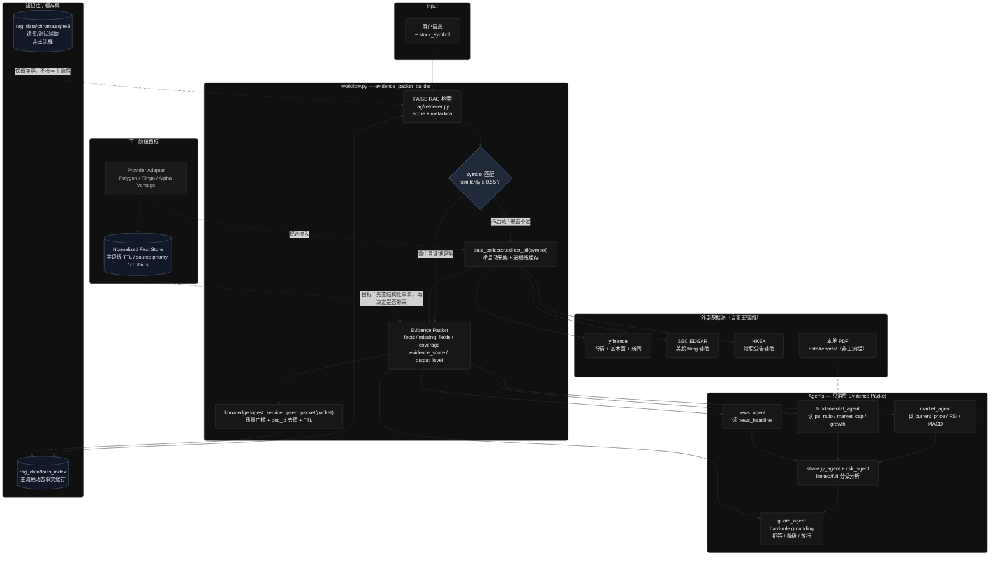

# AlphaPilot 数据源与 RAG 现状总结

> 记录日期：2026-06-05  
> 涵盖问题：  
> 1. `fundamental_agent` 的 RAG 知识库现状（是否只有 Tesla？静态还是动态？）  
> 2. `market_agent` 的市场数据是否只依赖 yfinance？

---

## 目录

- [问题一：fundamental_agent 与 RAG 知识库](#问题一fundamental_agent-与-rag-知识库)
  - [结论摘要](#结论摘要)
  - [fundamental_agent 本身不直接调 RAG](#fundamental_agent-本身不直接调-rag)
  - [项目存在两套 RAG 后端](#项目存在两套-rag-后端)
  - [当前知识库实际内容](#当前知识库实际内容)
  - [主流程中 RAG 如何参与基本面分析](#主流程中-rag-如何参与基本面分析)
  - [静态 vs 动态：设计意图与实际行为](#静态-vs-动态设计意图与实际行为)
  - [本地 PDF 财报（非向量 RAG）](#本地-pdf-财报非向量-rag)
- [问题二：market_agent 与 yfinance](#问题二market_agent-与-yfinance)
  - [结论摘要](#结论摘要-1)
  - [数据获取的两条路径](#数据获取的两条路径)
  - [yfinance 是唯一外部行情源](#yfinance-是唯一外部行情源)
  - [本地计算 vs 外部 API](#本地计算-vs-外部-api)
  - [RAG 与 market_agent 的关系](#rag-与-market_agent-的关系)
  - [容错机制（仍在 yfinance 链路上）](#容错机制仍在-yfinance-链路上)
  - [失败时的表现](#失败时的表现)
- [架构关系总览](#架构关系总览)
- [已知局限与后续改进方向](#已知局限与后续改进方向)

---

## 问题一：fundamental_agent 与 RAG 知识库

### 结论摘要

| 维度 | 现状 |
|------|------|
| 知识库标的覆盖 | **实质只有 Tesla（TSLA）** 相关文档 |
| 知识库形态 | **静态知识库**（脚本/手工写入后持久化到本地磁盘） |
| 动态入库能力 | 代码已实现（`upsert_packet`），但 **主流程未接入** |
| fundamental_agent 与 RAG | Agent **不直接调用**向量检索；走 Evidence Packet + 可选 PDF 解析 |

---

### fundamental_agent 本身不直接调 RAG

`fundamental_agent` 只注册了一个工具：`analyze_fundamental_request_tool`，职责是 **解析财报 PDF**，不是做语义检索。

**相关文件：** `alphapilot/agents/fundamental_agent.py`

```python
fundamental_agent = create_react_agent(
    model=model,
    tools=[analyze_fundamental_request_tool],  # 仅 PDF 解析工具
    name="fundamental_expert",
    prompt="""
    - Read the "Evidence Packet" section ...
    - Use the `analyze_fundamental_request_tool` ONLY if detailed PDF-based financial report extraction is needed.
    """
)
```

`fundamental_tools.py` 中虽然定义了 `retrieve_financial_context()`（调用 Chroma 向量库），但：

- **未注册为 agent 工具**
- **主 workflow 不会调用**
- 属于闲置辅助函数

---

### 项目存在两套 RAG 后端

这是理解现状的关键——两套系统并存，主流程只用其中一套。

| 组件 | 实现文件 | 存储位置 | 主流程是否使用 |
|------|----------|----------|----------------|
| **FAISS** | `alphapilot/rag/retriever.py` | `alphapilot/rag_data/faiss_index/` | **是** — `workflow.py` 的 `evidence_packet_builder` |
| **ChromaDB** | `alphapilot/rag/vectorstore.py` | `alphapilot/rag_data/chroma.sqlite3` | **否（主流程）** — 测试脚本、`news_tools` 辅助函数 |

```
用户请求
    │
    ▼
evidence_packet_builder (workflow.py)
    │
    ├── FAISS retriever.retrieve_with_scores()  ← 主流程 RAG
    │
    └── 冷启动 → collect_all() → yfinance / SEC / HKEX 等 API

fundamental_agent
    │
    ├── 读 Evidence Packet（可能含 rag_context）
    └── 可选：analyze_fundamental_request_tool → 本地 PDF 解析

Chroma (vectorstore.py)  ← 旁路，测试/遗留，未接入主流程
```

---

### 当前知识库实际内容

#### ChromaDB（`financial_reports` 集合）

截至 2026-06-05，共 **4 条文档**，全部为 TSLA 相关：

| # | 来源 | 类型 | 内容摘要 |
|---|------|------|----------|
| 1 | `test_rag.py` 手工写入 | 测试数据 | TSLA 2023 营收 +19%、EPS +25%、毛利率 18.2% |
| 2 | `test_rag_documents.py` 种子 | earnings | TSLA Q4 2024 业绩：交付 495,570 辆、营收 $25.7B (+2% YoY) |
| 3 | `test_rag_documents.py` 种子 | news | 2025 年 4 月中国销量同比 +36% |
| 4 | `test_rag_documents.py` 种子 | market | RSI/MACD 技术指标（偏技术面，非基本面） |

写入方式：运行 `alphapilot/test/test_rag.py` 或 `alphapilot/test/test_rag_documents.py`。

#### FAISS 索引

- 路径：`alphapilot/rag_data/faiss_index/`
- 索引体积极小（`index.faiss` ~6KB），与 `test_rag_documents.py` 中 TSLA 种子文档一致
- **无其他股票文档**

#### 本地 PDF 财报（非向量库）

- 路径：`alphapilot/data/reports/`
- 当前仅有：`TSLA-Q4-2024-Update.pdf`（约 11MB）
- 由 `analyze_fundamental_request_tool` 直接解析，**不经过向量检索**

---

### 主流程中 RAG 如何参与基本面分析

RAG 不直接进入 `fundamental_agent`，而是通过 **Evidence Packet** 间接提供上下文：

**文件：** `alphapilot/graph/workflow.py` → `evidence_packet_builder`

```
1. retriever.retrieve_with_scores(query, k=5)     # FAISS 检索
2. 按 symbol 过滤匹配结果
3. 判断冷启动：
   - top_score < 0.55 或无 metadata → 冷启动
   - 否则将 rag_context 写入 Evidence Packet
4. 冷启动时调用 collect_all(symbol) 拉实时 API 数据
5. fundamental_agent 读取 Evidence Packet + 可选 PDF 工具
```

冷启动时基本面数字来自 `collect_fundamental_facts()`（yfinance `Ticker.info`），**不会自动写回向量库**。

---

### 静态 vs 动态：设计意图与实际行为

| 模式 | 机制 | 当前状态 |
|------|------|----------|
| **静态（实际在用）** | `rag.add_document()` / 测试脚本写入 → 持久化到 `rag_data/` | ✅ 当前行为 |
| **动态（已实现未接入）** | `knowledge/ingest_service.py` → `upsert_packet()` 将 Evidence Packet 事实写入 Chroma | ❌ 全仓库无调用方 |
| **实时 API（非 RAG）** | 冷启动 `data_collector.collect_all()` 拉 yfinance 等 | ✅ 分析非 TSLA 标的时主要靠此路径 |

`upsert_packet` 的设计逻辑（`alphapilot/knowledge/ingest_service.py`）：

- `evidence_score >= 50` 才入库
- 过滤 `LLM_INFERRED` 和低置信度 `LLM_EXTRACTED` 事实
- 每条事实写成 `{field}: {value} (source: ..., date: ...)` 存入 Chroma
- 带 TTL 元数据（`fundamental_data` 默认 180 天）

**但 workflow 结束时从未调用此函数**，因此知识库不会随分析自动增长。

---

### 本地 PDF 财报（非向量 RAG）

`analyze_fundamental_request` 的 PDF 解析链路：

```
用户 query 中的 PDF URL/路径
    ↓（若无）
data/reports/{SYMBOL}*.pdf  glob 匹配
    ↓
PyMuPDF 逐页提取 + fitz.Table 表格优先
    ↓
LLM 结构化输出 FundamentalData (Pydantic)
```

解析策略（`fundamental_tools.py`）：

- 优先从 query 提取 PDF URL 或本地路径
- 回退到 `data/reports/` 按 symbol 匹配
- 表格优先于叙事文本；含 ±80% 营收边界校验

---

## 问题二：market_agent 与 yfinance

### 结论摘要

| 维度 | 现状 |
|------|------|
| 外部行情数据源 | **仅 yfinance**（`yf.download()`） |
| 技术指标来源 | yfinance 原始 OHLCV + **本地 pandas 计算**（RSI、MACD、波动率） |
| 其他行情 API | 未接入（无 Polygon、Alpha Vantage、IB 等） |
| RAG 角色 | 仅可能提供 `rag_context` 文本片段，**不提供结构化行情** |

---

### 数据获取的两条路径

`market_agent` 被设计为 **优先读 Evidence Packet，缺数据时才调工具**。

**文件：** `alphapilot/agents/market_agent.py`

```
路径 A（主流程，优先）
  evidence_packet_builder
    → 冷启动: collect_market_facts(symbol)   # yfinance
    → 写入 Evidence Packet (current_price, rsi_14, macd, ...)
  market_agent 直接分析 Packet，不调工具

路径 B（兜底）
  Evidence Packet 无市场数据
    → market_agent 调用 fetch_market_data(symbol)   # 仍是 yfinance
```

Agent prompt 约束：

- Packet 中已有 `current_price`、`rsi_14`、`macd`、`volatility` → **禁止**再调 `fetch_market_data`
- 仅当 Packet 完全没有市场数据时才调用工具

---

### yfinance 是唯一外部行情源

核心函数：`_download_price_frame()`（`alphapilot/tools/market_tools.py`）

```python
df = yf.download(sym, period="60d", progress=False, timeout=30)
# 可选 proxy 参数
```

调用方：

| 函数 | 文件 | 用途 |
|------|------|------|
| `fetch_market_data()` | `market_tools.py` | Agent 工具，输出技术面报告文本 |
| `collect_market_facts()` | `data_collector.py` | Workflow 冷启动，写入 Evidence Packet 结构化 facts |

`collect_market_facts` 产出的所有字段 `source` 均标注为 `"yfinance"`：

- `current_price`
- `price_change_pct`
- `rsi_14`
- `macd` / `macd_signal`
- `volatility_20d_annualized`
- `avg_volume_20d`

---

### 本地计算 vs 外部 API

yfinance 只提供原始 OHLCV；以下指标均在本地用 pandas 计算：

| 指标 | 计算方式 |
|------|----------|
| RSI(14) | 14 日涨跌均值比 |
| MACD | EMA(12) - EMA(26)，信号线 EMA(9) |
| 20 日波动率 | 日收益率 rolling std（年化或百分比，两处实现略有差异） |
| 5 日涨跌幅 | 收盘价比较 |
| 20 日均成交量 | Volume 列 rolling mean |

**文件：** `alphapilot/tools/market_tools.py`（Agent 工具）、`alphapilot/tools/data_collector.py`（Evidence Packet）

---

### RAG 与 market_agent 的关系

- 主流程 RAG（FAISS）命中时，Evidence Packet 可能包含 `rag_context` 文本
- 当前种子数据中有一条 TSLA 技术指标片段（RSI/MACD），属于 **非结构化文本**，不是替代 yfinance 的行情 API
- `market_agent` **没有** `retrieve_knowledge` 工具（已从 Agent tool list 移除，仅 workflow 节点使用）
- 正常冷启动路径下，市场数据 **100% 来自 yfinance**

---

### 容错机制（仍在 yfinance 链路上）

`_download_price_frame()` 的增强逻辑（不换数据源）：

| 机制 | 说明 |
|------|------|
| 代理切换 | `get_proxy_for_agent("market")`，代理失败则直连 |
| 限流退避 | 捕获 `YFRateLimitError`，指数退避重试（最多 2 次） |
| 港股格式 | 尝试 `0700.HK` / `700.HK` 等多种 symbol 格式 |
| 周期回退 | 港股 60d 失败时尝试 `1y` 周期 |
| 最终兜底 | 直连最后一次重试 |

---

### 失败时的表现

| 场景 | 行为 |
|------|------|
| yfinance 限流（`YFRateLimitError`） | `collect_market_facts` 返回空或 error flag；Evidence Packet 缺市场数据 |
| 所有 collector 失败 + 无 RAG | Escape Pod REJECT，`allowed_output_level = insufficient_evidence` |
| 所有 collector 失败 + 有 RAG | Escape Pod DEGRADE，仅用 `rag_context` 文本 |
| `market_agent` 收到 insufficient_evidence | 直接返回 "Market Analysis: NOT AVAILABLE"，不调用 LLM |

---

## 架构关系总览



**当前判断：**

- 主流程已经不是静态 RAG：`Evidence Packet` 会在质量达标后通过 `upsert_packet()` 回写 FAISS。
- 当前 RAG 更准确的定位是 **半动态事实缓存**，而不是完整数据治理型知识库。
- Market / Fundamental / News Agent 当前不再直接调用 RAG 或 yfinance，主要消费 Builder 写入 `state.evidence_packet` 的结构化事实。
- Chroma 仍保留为历史/测试模块，主流程以 FAISS 为准。
- 下一阶段应引入 Provider Adapter 和 Fact Store，用字段覆盖、TTL、source priority 替代单纯 similarity 阈值。

---

## 已知局限与后续改进方向

### RAG / 基本面

1. **RAG 已半动态，但还不是完整 Fact Store**：冷启动 facts 已能回写 FAISS，但缺少结构化 facts 表、字段级 TTL 查询和审计日志
2. **symbol-aware retrieval 仍需加强**：FAISS top-k 可能先召回其他股票，导致目标 symbol 文档被过滤后仍触发冷启动
3. **Chroma 仍为遗留/测试模块**：主流程已转向 FAISS，但 Chroma 相关代码仍存在，后续应明确保留、迁移或删除
4. **基本面关键字段覆盖不足**：`pe_ratio`、`market_cap`、`revenue_growth_yoy`、`eps_growth_yoy` 仍依赖 yfinance，缺少更稳定的官方/付费源
5. **冷启动判定仍偏 similarity 驱动**：下一阶段应改为字段覆盖 + TTL + source quality 驱动

### 市场数据

1. **单点依赖 yfinance**：限流或宕机即全链路市场分析不可用
2. **无备用行情源**：未接入 Polygon、Tiingo、Alpha Vantage 等
3. **进程级 collector cache 只是短期优化**：可减少评测重复下载，但不能替代持久化 Fact Store

### 建议优先级（供参考）

| 优先级 | 改进项 |
|--------|--------|
| P0 | 建 Provider 抽象层，先包装当前 yfinance collector |
| P0 | 接入 SEC EDGAR / Alpha Vantage，优先补基本面关键字段 |
| P1 | 建结构化 Fact Store，和 FAISS Vector Index 分层治理 |
| P1 | 实现 symbol-aware retrieval / metadata filter |
| P2 | 接入 Polygon、Tiingo 作为行情和新闻备用源 |

---

## 关键文件索引

| 文件 | 职责 |
|------|------|
| `alphapilot/agents/fundamental_agent.py` | 基本面 Agent 定义 |
| `alphapilot/agents/market_agent.py` | 市场 Agent 定义 |
| `alphapilot/tools/fundamental_tools.py` | PDF 解析、闲置 Chroma 检索 |
| `alphapilot/tools/market_tools.py` | yfinance 下载 + 技术指标计算 |
| `alphapilot/tools/data_collector.py` | Workflow 冷启动数据采集 |
| `alphapilot/graph/workflow.py` | Evidence Packet 构建、RAG 检索 |
| `alphapilot/rag/retriever.py` | FAISS RAG（主流程） |
| `alphapilot/rag/vectorstore.py` | Chroma RAG（遗留/测试） |
| `alphapilot/knowledge/ingest_service.py` | Evidence Packet 动态入库 FAISS（质量门槛、去重、TTL） |
| `alphapilot/data/reports/` | 本地 PDF 财报 |
| `alphapilot/rag_data/` | 向量库持久化目录 |
| `alphapilot/test/test_rag.py` | Chroma TSLA 测试写入 |
| `alphapilot/test/test_rag_documents.py` | FAISS + Chroma TSLA 种子数据 |

---

*本文档基于代码库现状（2026-06-05）整理，若后续接入新数据源或统一 RAG 后端，请同步更新此文档。*
