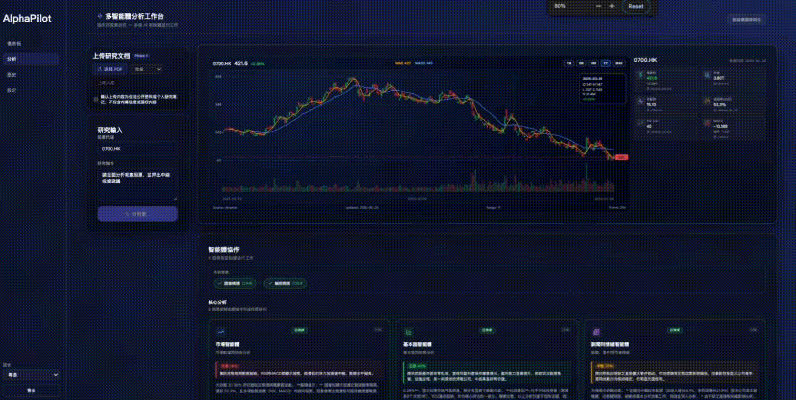

# AlphaPilot

[](README.md)
[](alphapilot/requirements.txt)
[](frontend/package.json)
[](alphapilot/graph/)

**Evidence-first, multi-agent equity research platform** — Evidence Packet · document RAG · Guard hard rules · `[doc:N]` audit trail

<p align="center">
  
  
</p>

**Full walkthrough (~3 min)**

| Platform | Link |
|----------|------|
| Bilibili | _Replace with BV URL after upload_ |
| LinkedIn | _Replace with post URL after upload_ |

> **Disclaimer**: For research and engineering demonstration only. Outputs are not investment advice. Read the disclaimer on the analysis page; private document uploads require explicit consent.

---

## What It Is

AlphaPilot wires **data collection → document retrieval → multi-agent reasoning → fact checking → persisted reports** into one auditable pipeline:

1. **Evidence Packet Builder** runs before the Orchestrator: market/fundamental/news providers plus **Document Evidence** from filings, announcements, and user-uploaded PDFs.
2. **14+ specialized agents** (including Bull vs Bear debate) consume a **single** `evidence_packet` — they do not call tools or RAG on their own.
3. **Guard Agent** applies deterministic checks (field grounding, symbol match, document `[doc:N]` grounding) with optional correction retries.
4. **Audit Trail** maps `[doc:N]` in the final report to vector-store `chunk_id`s in SQLite; exposed via History API and the UI.

Compared with “single-turn chat + bolt-on RAG”, this project emphasizes **control, traceability, and degradation paths** (`insufficient` / `limited` / `full_analysis`) — relevant for Fintech grounding and compliance narratives.

---

## Core Highlights

| Capability | Description |
|------------|-------------|
| **Evidence Packet first** | Collection, hybrid retrieval, scoring, and `allowed_output_level` before agent routing |
| **Dual-track evidence** | `structured_facts` (yfinance, EastMoney, AKShare, …) + `document_evidence` (HKEX, SEC, uploads) |
| **Document-aware RAG** | FAISS + FTS5 hybrid search, section/doc_type boost, recency weighting, per-session upload isolation |
| **Bull vs Bear debate** | Subgraph on `full_analysis`; Strategy weights Market 25% + Fundamental 35% + News 15% + Debate 25% |
| **Executive Synthesis** | Recommendation synthesizes cross-agent insights and tensions — not per-agent repetition |
| **Guard anti-hallucination** | Field- and document-level grounding (L1–L3), output-level gating, cold-start limited paths |
| **Audit Trail** | `analysis_citations` persists `chunk_ids`; **Document Citation Audit** table on analyze & history pages |

---

## Demo

End-to-end outputs from **M1–M6** (PDF parse → chunking → section-boost retrieval → Evidence Packet → agents → Guard → `[doc:N]` audit):

| Symbol | Market | Sample report | Typical metrics (`full_analysis`) |
|--------|--------|---------------|-----------------------------------|
| **0700.HK** Tencent | HK | [0700.HK_analysis_sample.md](Docs/demo/0700.HK_analysis_sample.md) | Evidence **97** · Guard ✅ · Strategy **Hold** (65) |
| **AAPL** Apple | US | [AAPL_analysis_sample.md](Docs/demo/AAPL_analysis_sample.md) | SEC 10-K · Risk Factors / MD&A · Executive Synthesis |

**UI**: financial snapshot, bull/bear debate, valuation summary, risk dashboard, Guard checklist, **Audit Trail** panel. GIFs and full video links are at the top of this file.

<details>
<summary><strong>Reproduce the demo (expand)</strong></summary>

From the repo root (scripts add `alphapilot` to `PYTHONPATH`):

```bash
cd alphapilot

# 1. Rebuild / verify document ingest
PYTHONPATH=. python ../scripts/reingest_0700.py
PYTHONPATH=. python ../scripts/prepare_demo_ingest.py --symbol AAPL

# 2. Full pipeline (no HTTP; writes JSON + Markdown)
PYTHONPATH=. python ../scripts/run_analysis_direct.py 0700.HK

# 3. Or via Web UI (API + frontend running)
# bash ../scripts/run_demo_analysis.sh 0700.HK

# 4. Offline evaluation (optional)
PYTHONPATH=. python ../scripts/eval_doc_recall.py
PYTHONPATH=. python ../evaluation/guard_grounding_report.py

# 5. P4 regression: upload / session isolation / redaction (API + test account)
python scripts/verify_p4.py --username <user> --password <pass>
# Or set VERIFY_P4_USERNAME / VERIFY_P4_PASSWORD
```

</details>

---

## Architecture

```text
User → React (EN / ZH / Yue) → FastAPI → LangGraph StateGraph
                                      │
                                      ▼
                            Evidence Packet Builder
                            ├── FAISS structured facts + Fact Store cache
                            ├── hybrid_retrieve (vector + FTS5 + recency)
                            ├── multi-provider collection + field dedup
                            ├── document_evidence (public fetch + user upload)
                            └── scoring → allowed_output_level
                                      │
                                      ▼
                                 Orchestrator
                            ├── insufficient → Guard → END
                            ├── limited    → Market + Fundamental + News
                            │               → Strategy → Risk → Guard → END
                            └── full       → Market + Fundamental + News
                                            → Bull vs Bear debate (≤2 rounds)
                                            → Strategy → Risk
                                            → Portfolio → Backtest → Recommendation
                                            → Guard → END
                                      │
                                      ▼
                    SQLite (analyses · events · analysis_citations · sessions)
```

**Principle**: agents **never** call market APIs or RAG directly; they read `state.evidence_packet`. Streaming uses **SSE** (`agent_start` / `agent_output` / `analysis_complete` including `citations`).

See [alphapilot/Docs/architecture.md](alphapilot/Docs/architecture.md) for the full v4.3 design (some sections in Chinese).

---

## Agents

| Agent | Node | Role | Tools |
|-------|------|------|-------|
| Market | `market_data_expert` | Technical summary | Packet only |
| Fundamental | `fundamental_expert` | Fundamentals | Packet only |
| News | `news_sentiment_expert` | News & sentiment | Packet only |
| Bull / Bear | `debate_stage` | Adversarial debate | Packet only |
| Strategy | `strategy_expert` | Buy/Hold/Sell synthesis | Packet only |
| Risk | `risk_expert` | Risk score & stops | Packet only |
| Portfolio | `portfolio_agent` | Position sizing | `full_analysis` only |
| Backtesting | `backtesting_agent` | Backtest narrative | `full_analysis` only |
| Recommendation | `recommendation_agent` | Executive Synthesis | full / personalized |
| Guard | `guard_agent` | Hard rules (no LLM) | Deterministic Python |

System nodes: `evidence_packet_builder`, `orchestrator`.

---

## Audit Trail

After each completed analysis:

1. `services/citations.build_citations()` extracts `[doc:N]` from `final_report`;
2. Maps to `evidence_packet.document_evidence[N-1].chunk_id`;
3. Persists to SQLite `analysis_citations` (`chunk_ids`, `doc_markers`, `evidence_snapshot`);
4. Shown on the **analyze page** (below Guard) and **history detail** via `GET /history/{id}` → `citations`.

```json
{
  "citations": {
    "chunk_ids": ["0700.HK_Q1_2026_..._Financial_Statements_p12_i01"],
    "doc_markers": ["doc:3"],
    "evidence_snapshot": [
      { "chunk_id": "...", "section": "Financial Statements", "source": "HKEX" }
    ]
  }
}
```

> Guard’s “Sources (40)” lists **structured fact providers** (yfinance, Reuters, …). Audit Trail tracks **document chunk** citations — not the same thing.

---

## Quick Start

### Requirements

- Python **3.12+**
- Node.js **18+**
- At least one LLM API key (recommended: **DeepSeek**; optional Gemini)

### Backend

```bash
cd alphapilot
pip install -r requirements.txt
# Recommended: pip install pdfplumber

# Configure alphapilot/.env (do not commit secrets); see deploy/.env.prod.example
# Required: DEEPSEEK_API_KEY, JWT_SECRET (≥32 random bytes in production)
python -m api.main
# → http://localhost:8000
```

### Frontend

```bash
cd frontend
npm install
npm run dev
# → http://localhost:5173  (proxies /api → 8000)
```

### Docker (optional)

```bash
docker compose -f alphapilot/docker-compose.yml up -d
# Production: deploy/docker-compose.prod.yml
```

### Environment variables (common)

| Variable | Purpose |
|----------|---------|
| `DEEPSEEK_API_KEY` | Primary LLM (per-agent routing) |
| `GOOGLE_API_KEY` | Optional Gemini / embeddings |
| `JWT_SECRET` | JWT signing; **do not use** default `change_this_in_prod` |
| `ENABLED_DATA_PROVIDERS` | e.g. `yfinance,sec_edgar,akshare,eastmoney` |
| `DOC_FETCH_ENABLED` | `true` for scheduled HKEX/SEC/News fetch |
| `DOC_FETCH_SYMBOLS` | e.g. `TSLA,AAPL,0700.HK` |
| `HF_TOKEN` | Optional; fewer HF rate-limit warnings when Guard loads embeddings |
| `VERIFY_P4_*` | Credentials / API URL for P4 acceptance script |

Proxies (e.g. China): see `alphapilot/config/proxy.py` (`MARKET_PROXY`, `LLM_PROXY`, …).

---

## Quality & Acceptance

| Script | Purpose |
|--------|---------|
| `scripts/eval_doc_recall.py` | Document Recall@5 / @15 (curated queries) |
| `evaluation/guard_grounding_report.py` | Guard grounding & `[doc:N]` ↔ chunk alignment |
| `alphapilot/scripts/verify_p4.py` | HTTP upload, session isolation, redaction, workflow |
| `alphapilot/test/test_analysis_citations.py` | Audit Trail unit tests |

Details: [Docs/M6-评估脚本开发文档.md](Docs/M6-评估脚本开发文档.md) (Chinese).

---

## API Overview

Base path: `/api` (Vite proxy). Authenticated routes: `Authorization: Bearer <token>`.

| Method | Path | Description |
|--------|------|-------------|
| POST | `/auth/register` · `/login` · `/refresh` | Auth |
| GET/PUT | `/profile` | Risk preference, investment horizon |
| GET/POST | `/sessions` | Sessions & messages |
| POST | `/analyze` | Sync analysis |
| POST | `/analyze/stream` | **SSE streaming** (recommended) |
| POST | `/upload/document` | PDF upload; requires `consent_at` |
| GET | `/history` | Analysis list |
| GET | `/history/{id}` | Detail with `events` + **`citations`** |
| GET | `/dashboard/stats` | Dashboard |
| GET | `/health` | Health check |

Also: `/compare`, `/backtest`, `/alert`, `/optimize`.

---

## Compliance & Product

- **Report disclaimer** on the analysis page — not investment advice.
- **Upload consent** checkbox; API logs `consent_at`.
- **SFC GenAI (engineering angle)**: unified evidence via Evidence Packet, Guard hard rules, Audit Trail, and human-readable reports to reduce untraceable hallucination risk (not legal advice).

---

## Tech Stack

| Layer | Stack |
|-------|-------|
| Frontend | React 18 + Vite + TypeScript, custom dark theme |
| Backend | FastAPI + Uvicorn + Python 3.12 |
| Orchestration | LangGraph StateGraph + SQLite checkpointer |
| LLM | DeepSeek / Gemini per agent (`config/llm.py`) |
| Vectors | FAISS (`all-MiniLM-L6-v2`) + FTS5 |
| Database | SQLite WAL (users, sessions, analyses, events, citations) |
| Real-time | SSE |
| i18n | English / Simplified Chinese / Cantonese |
| CI/CD | GitHub Actions + Docker + GHCR |

---

## Project Layout

```text
Alphapilot/
├── alphapilot/           # Python backend
│   ├── api/              # FastAPI
│   ├── agents/           # 14 agents + Guard
│   ├── graph/            # Workflow & debate subgraph
│   ├── services/         # analysis_service, citations
│   ├── knowledge/        # PDF parse, ingest, scheduler
│   ├── rag/              # hybrid_retrieve, FAISS
│   └── scripts/verify_p4.py
├── frontend/             # React SPA
├── scripts/              # Demo, eval, reingest (repo root)
├── evaluation/
├── Docs/
└── deploy/
```

---

## User Profile

Configure in **Settings** or `GET/PUT /profile`:

- **Risk preference**: Low / Medium / High — affects Recommendation tone and sizing
- **Investment horizon**: Short / Medium / Long — injected into LangGraph state

---

## CI/CD

- **CI**: Backend Ruff + Pytest; frontend ESLint + TypeScript + Vitest + build
- **CD**: Image build → GHCR → SSH deploy (`.github/workflows/`)

---

## Documentation

| Doc | Description |
|-----|-------------|
| [architecture.md](alphapilot/Docs/architecture.md) | System design, agents, SSE, GraphState |
| [文档提取与RAG功能.md](Docs/文档提取与RAG功能.md) | Document RAG design & status (Chinese) |
| [HK-Fintech-AI-竞争力优化方案.md](Docs/HK-Fintech-AI-竞争力优化方案.md) | Portfolio narrative (Chinese, optional) |

Milestones, acceptance reports, and eval guides live under [`Docs/`](Docs/).  
Simplified Chinese readme: [README.md](README.md).

---

## Troubleshooting

| Symptom | Fix |
|---------|-----|
| Startup `pdfplumber=False` | `pip install pdfplumber` for better tables |
| Many HuggingFace HEAD requests before Guard | First embedding load; set `HF_TOKEN` or pre-download model |
| `InsecureKeyLengthWarning` (JWT) | Use `JWT_SECRET` ≥ 32 random bytes |
| No document chunks in analysis | Run `reingest_0700.py` or `prepare_demo_ingest.py` |
| No agent text in server terminal | Content is SSE-only; use UI or `GET /history/{id}` |
| Analysis interrupted in dev | Avoid code edits triggering `--reload` mid-run |

---

## License

Personal portfolio and engineering demo. Configure secrets, hosting, and compliance before any production use.
