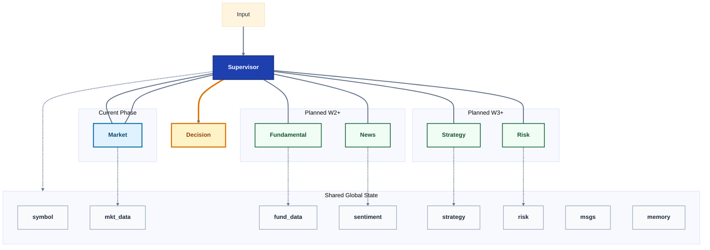
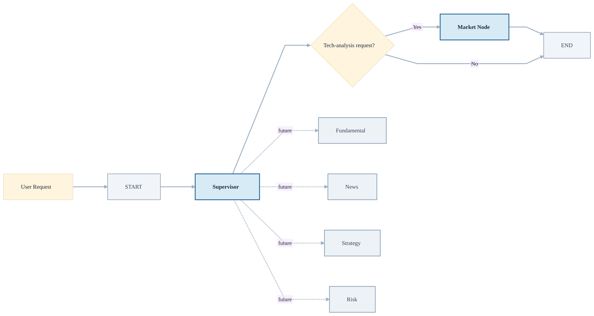

# Alphapilot Architecture

## 1. System Overview

**Overview notes**

- `User Input`: 用户输入股票代码与分析需求。
- `Supervisor`: 负责路由、协调各个 agent，并聚合结果。
- `Market Data Agent`: 当前已实现，负责技术面与市场数据分析。
- `Fundamental Agent`: 计划接入，负责基本面分析与财报 RAG。
- `News & Sentiment Agent`: 计划接入，负责新闻、舆情与事件提取。
- `Strategy Agent`: 计划接入，负责综合推理与评分。
- `Risk Agent`: 计划接入，负责风险评估与止损建议。
- `Final Output`: 输出 `Buy / Hold / Sell` 及可解释报告。
- `Shared State`: 图中使用简写字段名，分别对应 `stock_symbol`、`market_data`、`fundamental_data`、`news_sentiment`、`strategy_recommendation`、`risk_assessment`、`messages`、`memory`。

## 2. Execution Flow

**Execution notes**

- 当前 `workflow.py` 的真实执行路径是：`START -> Supervisor Node -> Market Node -> END`。
- `Supervisor Node` 会读取用户最后一条消息，并判断是否属于技术分析请求。
- 若命中技术分析相关关键词，则路由到 `Market Node`。
- 若未命中，则直接结束流程。
- `Fundamental / News / Strategy / Risk` 目前仍属于后续扩展节点，尚未接入实际执行链路。
